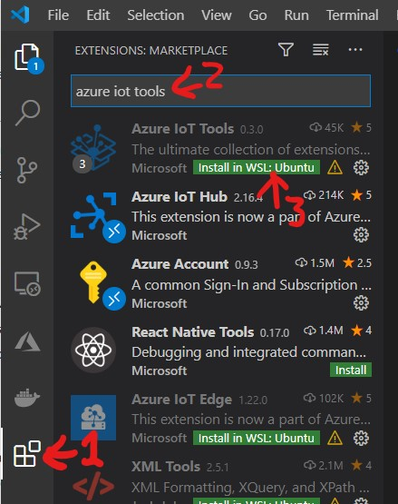
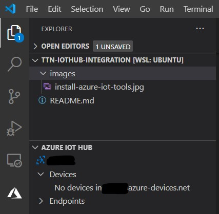

# The Things Network integration with Azure Iot Hub over HTTP

A walkthrough and sample for connecting a 'The Things Network' gateway to Azure IoT Hub.

The steps we will carry out are:
1. Get the TTN Indoor Gateway connected to your wireless network
2. Associate the gateway to the Things Network
3. Set up the IoT Hub in Azure
4. Create an IoT Device and get credentials
5. Set up a TTN application integration to push messages over HTTP

## Set up the TTN Gateway

* Sign up for free to [The Things Network](https://account.thethingsnetwork.org/register)
* Follow the [Quickstart] to get the gateway connected to your home Wifi and associated to your TTN account.
* Fill in the various information about your gateway in the console

## Set up Azure Environment

* Go to the [Microsoft Azure Portal](https://portal.azure.com) and sign in with your Microsoft account.

    > Even without an existing subscription you can sign up and get free credit to get started!

* Create a [new resource group](https://portal.azure.com/#create/Microsoft.ResourceGroup). Use any name you like and choose a region near you.
* Create an [IoT Hub](https://portal.azure.com/#create/Microsoft.IotHub) in your new resource group. You can keep all of the default options.
    > For this use case we could use any of the available tiers, including the cheaper B1 Basic tier or even the F1 Free tier. If you will be connecting other types of IoT devices to this IoT Hub as well then the S1 Standard is the best choice.

## Create a device and get credentials

At this pooint we have lots of options for how to create a device and generate the required credentials but I'll go through my favourite since this will also later let us view incoming data.

* Download and install [Visual Studio Code](https://code.visualstudio.com/Download)
* Open VS Code and install the `Azure IoT Tools` extension

    

* Once installed use the command palette (`Ctrl + Shift + P`) to do `Azure : Sign In`

    > This will open a browser window where you sign in with your Microsoft Account and it then returns back to VS Code.

* Next use the command palette again to `Azure IoT Hub: Select IoT Hub'. You will then select your subscription and then get to choose your IoT Hub. If all goes well you should see a populated 'Azure IoT Hub' panel in Explorer view (it might be collapsed down the bottom).

    

* To create our IoT Device we click on the ellipsis `...` next to the Azure IoT Hub heading and select `Create Device`. Give the device a name like `ttn integration` and press enter.

* In the output we see the metadata for the device including the symmetric keys used for device authentication. These keys are used to derive the SAS tokens we need for authenticating ourselves over the REST API.

* Whilst we are in VS Code we will generate the SAS token we will need shortly. Right click on your device and select `Generate SAS Token for Device` and enter an expiry time in hours. Copy the whole output line to clipboard, including the SharedAccessSignature prefix.

    > Where the device itself generates SAS tokens we would choose a short expiry but in this case we have to refresh by hand so we put a longer expiry time in. One year is just over 61,000 hours.