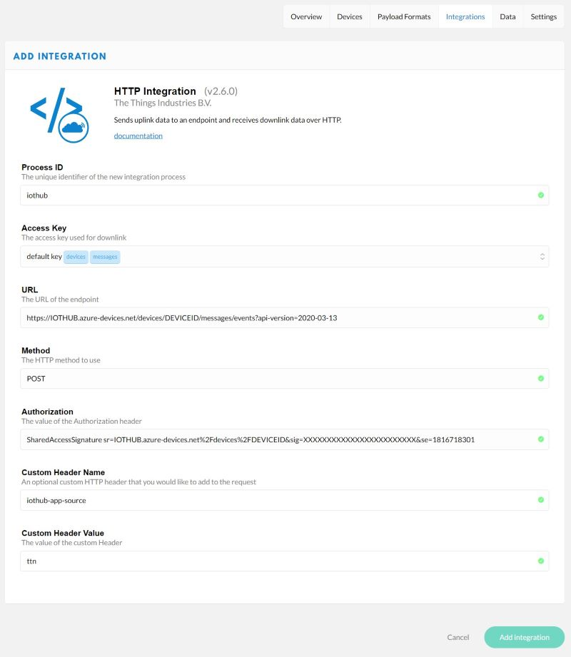

# The Things Network integration with Azure IoT Hub over HTTP

A walkthrough and sample for connecting a 'The Things Network' gateway and LoRa device to Azure IoT Hub.The get started you will need:

* A Things Network Gateway such as the TTIG
* A LoRa device that can connect to the gateway and send messages

The steps we will carry out are:

1. Get the TTN Indoor Gateway connected to your wireless network
2. Associate the gateway to the Things Network
3. Set up the IoT Hub in Azure
4. Create an IoT Device and get credentials
5. Set up a TTN application integration to push messages over HTTP
6. Use the VS Code IoT Hub extension to view data
7. Send a message back to the device

## Set up the TTN Gateway

* Sign up for free to [The Things Network](https://account.thethingsnetwork.org/register)
* Follow the [Quickstart](https://www.thethingsnetwork.org/docs/gateways/thethingsindoor/) to get the gateway connected to your home Wifi and associated to your TTN account.
* Fill in the various information about your gateway in the console

## Set up Azure Environment

* Go to the [Microsoft Azure Portal](https://portal.azure.com) and sign in with your Microsoft account.

    > Even without an existing subscription you can sign up and get free credit to get started!

* Create a [new resource group](https://portal.azure.com/#create/Microsoft.ResourceGroup). Use any name you like and choose a region near you.
* Create an [IoT Hub](https://portal.azure.com/#create/Microsoft.IotHub) in your new resource group. You can keep all of the default options.
    > For this use case we could use any of the available tiers, including the cheaper B1 Basic tier or even the F1 Free tier. If you will be connecting other types of IoT devices to this IoT Hub as well then the S1 Standard is the best choice.

## Create a device and get credentials

At this pooint we have lots of options for how to create a device and generate the required credentials but I'll go through my preferred method since this will also later let us view incoming data.

* Download and install [Visual Studio Code](https://code.visualstudio.com/Download)
* Open VS Code and install the `Azure IoT Tools` extension

    

* Once installed use the command palette (`Ctrl + Shift + P`) to do `Azure : Sign In`

    > This will open a browser window where you sign in with your Microsoft Account and it then returns back to VS Code.

* Next use the command palette again to `Azure IoT Hub: Select IoT Hub'. You will then select your subscription and then get to choose your IoT Hub. If all goes well you should see a populated 'Azure IoT Hub' panel in Explorer view (it might be collapsed down the bottom).

    

* To create our IoT Device we click on the ellipsis `...` next to the Azure IoT Hub heading and select `Create Device`. Give the device a name like `ttn integration` and press enter.

* In the output we see the metadata for the device including the symmetric keys used for device authentication. These keys are used to derive the SAS tokens we need for authenticating ourselves over the REST API.

* Whilst we are in VS Code we will generate the SAS token we will need shortly. Right click on your device and select `Generate SAS Token for Device` and enter an expiry time in hours. Copy the whole output line to clipboard, including the SharedAccessSignature prefix.

    > Where the device itself generates SAS tokens we would choose a short expiry but in this case we have to refresh by hand so we put a longer expiry time in. One year is just over 61,000 hours.

## Setting up the Things Networks application integration

This is the interesting bit where 

* The first thing to do is fully complete the [Things Uno Quickstart Guide](https://www.thethingsnetwork.org/docs/devices/uno/quick-start.html). In this guide you will do the following:
  * Create an [Application](https://console.thethingsnetwork.org/applications) in the TTN Console.
  * Set up an Arduino development environment and connect your device to your PC.
  * Get the device registered and connected to the application.
  * Send and receive data with the device.
  * Create Payload Formatters.
* Our next step is to create the Azure IoT Hub integration. Within your [Application Console](https://console.thethingsnetwork.org/applications), select `Integrations` and click on `add integration`.
* There are many options available for integration and we are going to choose `HTTP Integration` as the simplest. The [HTTP Integration Documentation](https://www.thethingsnetwork.org/docs/applications/http/) provides more information on the attributes needed.
* Fill out the following:
  * **Process ID**: Anything you want
  * **Access Key**: Select the only entry in the list
  * **URL**: This needs to be formed based on your IoT Hub URL and Device ID for the device you created early. The format is `https://{fully-qualified-iothubname}.azure-devices.net/devices/{id}/messages/events?api-version=2020-03-13`

        > The source of this URL is comprehensive description of the [IoT Hub Send Device Event API](https://docs.microsoft.com/en-us/rest/api/iothub/device/senddeviceevent) 

  * **Method**: `POST`
  * **Authorization**: This is the full SAS token you generated earlier   

        > The documentation for authenticating against the API is in the [IoT Hub API Overview](https://docs.microsoft.com/en-us/rest/api/iothub/)

  * **Custom Header Name**: Anything you like provided it starts with `iothub-app-`

        > This is also described in the [IoT Hub Send Device Event API](https://docs.microsoft.com/en-us/rest/api/iothub/device/senddeviceevent)

  * **Custom Header Value**: Any string

        > As per [documentation](https://docs.microsoft.com/en-us/azure/iot-hub/iot-hub-devguide-messages-construct), property names and values can only contain ASCII alphanumeric characters, plus {'!', '#', '$', '%, '&', ''', '*', '+', '-', '.', '^', '_', '`', '|', '~'} when you send device-to-cloud messages using the HTTPS protocol or send cloud-to-device messages.

    

* Finish by clicking on `Add Integration`
  > At this stage the integration *should* be working but we won't get any errors in the TTN console even if it went wrong. The next step is to confirm data is being received.

## Using VS Code to see incoming messages

The Azure IoT Tools extension that we installed earlier can also be used for monitoring messages that are received by the IoT Hub.

* Open VS Code and open the Azure IoT Hub panel
* Either right-click on the specific device you want to monitor or click on the elipsis for IoT Hub and select `Start Monitoring Built-In DeviEventce Endpoint`
    > This will only show output if you have not changed the Message Routing in the IoT Hub

* In the output window you will see as messages come through from the TTN endpoint

    

* The Things Network [HTTP Integration Documentation](https://www.thethingsnetwork.org/docs/applications/http/) provides a comprehensive overview of the payload and particularly how the downlink can be used.

### Example message

```json
{
    "app_id": "APPID",
    "dev_id": "DEVID",
    "hardware_serial": "000000000000000",
    "port": 1,
    "counter": 92,
    "payload_raw": "AA==", // This is the raw base 64 payload
    "payload_fields": { // payload_fields are the output of the decoder, converter, validator pipeline
        "led": false
    },
    "metadata": {
        "time": "2020-09-24T08:05:42.800365668Z",
        "frequency": 867.5,
        "modulation": "LORA",
        "data_rate": "SF7BW125",
        "coding_rate": "4/5",
        "gateways": [ // useful metadata about the connection. 
            {
                "gtw_id": "eui-XXXXXXXXXXXXX",
                "timestamp": 225820444,
                "time": "2020-09-24T08:05:42.87820506Z",
                "channel": 0,
                "rssi": -57,
                "snr": 6.75,
                "rf_chain": 0
            }
        ]
    },
    // The downlink_url is the most interesting field beyond the payload.
    "downlink_url": "https://integrations.thethingsnetwork.org/ttn-eu/api/v2/down/APPID/INTEGRATIONID?key=TOKEN"
}
```
